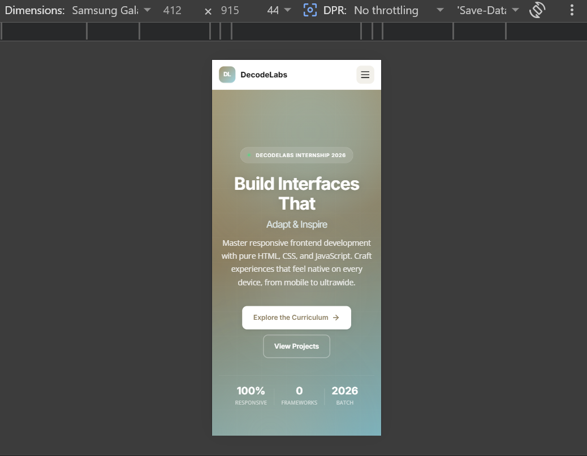
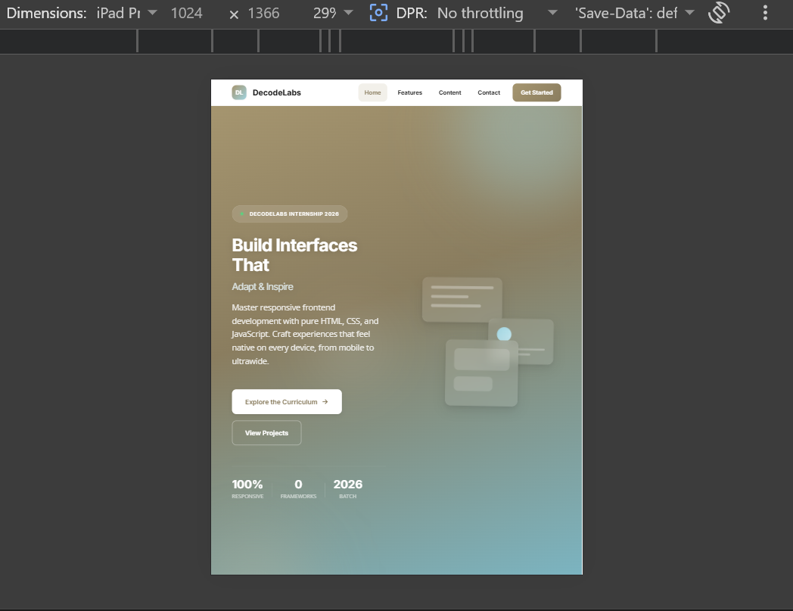
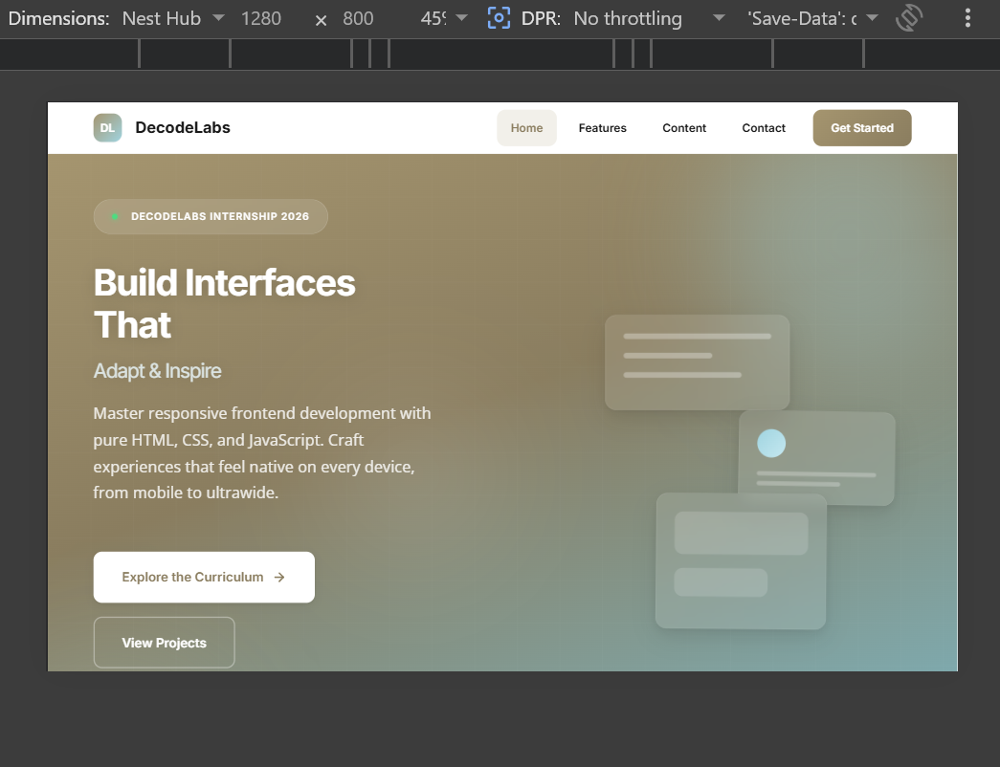

# DecodeLabs Internship Project 1 — Responsive Frontend Interface

&gt; A senior-level, mobile-first responsive layout built with pure HTML5, CSS3, and JavaScript. Zero frameworks. Production-grade accessibility and semantic structure.

---

## Table of Contents

- [Overview](#overview)
- [Live Demo](#live-demo)
- [Screenshots](#screenshots)
- [Features](#features)
- [Tech Stack](#tech-stack)
- [Design System](#design-system)
- [Getting Started](#getting-started)
- [Project Structure](#project-structure)
- [Accessibility](#accessibility)
- [Browser Support](#browser-support)
- [License](#license)

---

## Overview

This project is part of the **DecodeLabs 2026 Full Stack Virtual Internship Program**. It demonstrates mastery of responsive frontend fundamentals through a real-world landing page interface that adapts seamlessly across mobile, tablet, and desktop viewports.

The implementation prioritizes:
- **Semantic integrity** — proper HTML5 landmarks and ARIA practices
- **Fluid layouts** — CSS Grid and Flexbox with `clamp()`-based typography
- **Inclusive design** — WCAG-compliant contrast, focus states, and screen-reader support
- **Performance** — zero external dependencies beyond Google Fonts; no frameworks

---

## Screenshots

| Mobile (375px) | Tablet (768px) | Desktop (1280px) |
|:--:|:--:|:--:|
|  |  |  |

*Tested on Samsung Galaxy S20, iPad Pro, and Nest Hub viewports.*

---

## Features

- [x] **Mobile-first responsive architecture** — breakpoints at `768px` and `1024px`
- [x] **Sticky glassmorphism header** — `backdrop-filter` blur with scroll-aware behavior
- [x] **Animated hero section** — floating orbs, grid patterns, and decorative glass cards
- [x] **CSS Grid & Flexbox hybrid** — macro layouts via Grid, micro components via Flexbox
- [x] **Fluid typography & spacing** — `clamp()` functions for seamless scaling
- [x] **Accessible mobile navigation** — toggle with ARIA states, keyboard Escape support, focus trapping via `visibility`
- [x] **Contact form validation** — real-time blur validation with inclusive name handling
- [x] **Toast notification system** — custom alert component with `role="alert"`
- [x] **Scroll-to-top button** — appears after 500px scroll
- [x] **Active section highlighting** — dynamic `aria-current` on nav links
- [x] **Reduced motion support** — respects `prefers-reduced-motion`
- [x] **Print stylesheet** — optimized layout for print media
- [x] **Intersection Observer reveals** — cards fade-in on scroll

---

## Tech Stack

| Layer | Technology |
|-------|------------|
| Markup | HTML5 (semantic landmarks) |
| Styling | CSS3 (Custom Properties, Grid, Flexbox, `clamp()`) |
| Behavior | Vanilla JavaScript (ES6+, IIFE pattern) |
| Fonts | Inter (headlines), Open Sans (body) via Google Fonts |
| Icons | Inline SVG (optimized, accessible) |

---

## Design System

### Color Palette

| Token | Hex | Usage |
|-------|-----|-------|
| Mocha | `#A5956F` | Primary brand, buttons, accents |
| Mocha Dark | `#8A7D5F` | Hover states, gradients |
| Ethereal | `#A0D4E0` | Secondary accent, focus rings |
| Ethereal Dark | `#7AB8C8` | Gradients, links |
| Moonlit | `#F2F0EA` | Section backgrounds |
| Text Primary | `#1A1A1A` | Headlines, body text |
| Text Secondary | `#4A4A4A` | Descriptions |
| Text Muted | `#8A8A8A` | Meta text, placeholders |

### Typography Scale

All type uses fluid `clamp()` scaling between mobile and desktop:

- **H1**: `2.5rem` → `4.5rem`
- **H2**: `2rem` → `3rem`
- **H3**: `1.5rem` → `2rem`
- **Body**: `1rem` → `1.125rem`

### Breakpoints

| Name | Width | Layout Changes |
|------|-------|----------------|
| Mobile | `&lt; 768px` | Single column, hamburger nav, stacked hero |
| Tablet | `≥ 768px` | Two-column grids, inline nav, side-by-side hero |
| Desktop | `≥ 1024px` | Three-column features, horizontal article cards |
| Large | `≥ 1280px` | Max container width, enlarged hero visuals |

---

## Getting Started

### Prerequisites

- A modern web browser (Chrome, Firefox, Safari, Edge)
- Git (for cloning)

### Installation

```bash
# Clone the repository
git clone https://github.com/ahmedabbas52233-a11y/Internship-Project-1.git

# Navigate into the project
cd Internship-Project-1

# Open in browser (or use Live Server in VS Code)
open index.html

## 📂 Repository Structure

Internship-Project-1/
├─ Internship-Project-1/part1-responsive-frontend
├─ index.html
├─ css/
│   └─ styles.css
├─ js/
│   └─ app.js
├─ assets/
│   └─ images, icons
└─ README.md